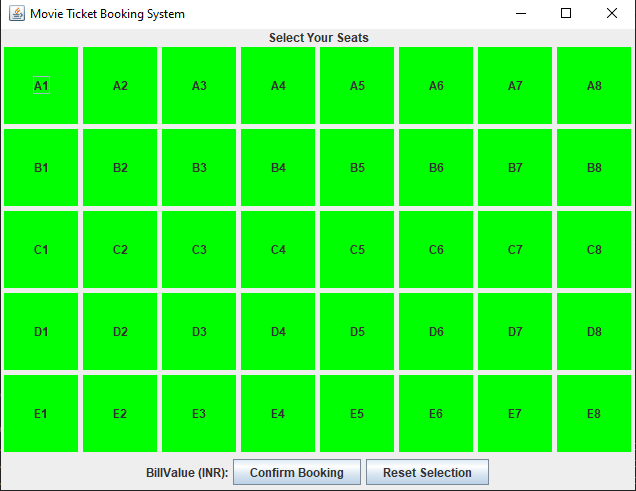
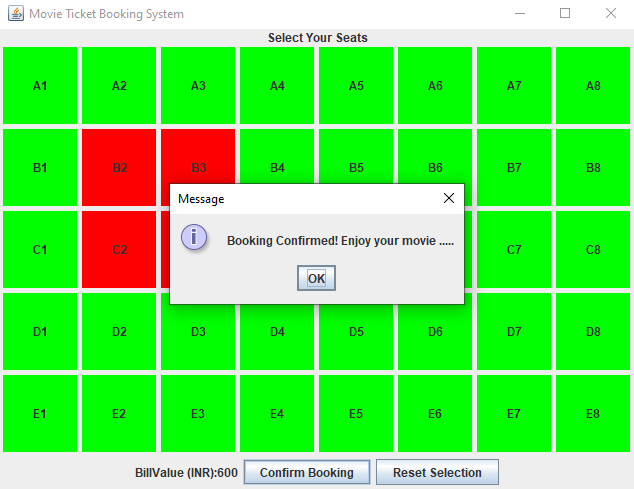
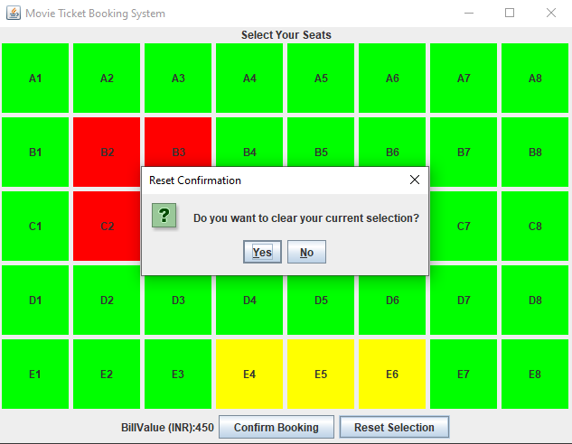
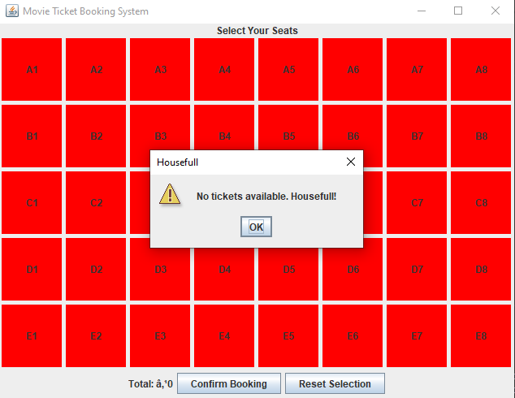

# 🎬 Movie Ticket Booking System (Java Swing)

A simple Java Swing GUI application to book movie tickets. The Movie Ticket Booking System is a Java Swing-based desktop application that allows users to select and book seats for a movie in a theatre. The system provides a user-friendly interface where available seats are shown in green, selected seats in yellow, and booked seats in red. If all the seats are booked then it displays HouseFull so that whenever we try to book some more tickets even after housefull it displays no tickets available.

Users can:

Select and confirm multiple seats at once.

Reset their current seat selections before booking.

Cancel previously booked seats.

View total ticket cost in real-time.

See a Housefull notification when all seats are booked, preventing further bookings.

This project demonstrates basic GUI design, event handling, and simple state management in Java. It is ideal for beginners learning Java Swing and building interactive desktop applications.

## ✨ Features
- Green = Available
- Yellow = Selected
- Red = Booked
- Confirm bookings
- Reset selection
- Cancel booked seats
- Shows "Housefull" when no tickets available

## 📸 Screenshots
### Seat Layout


### Booking Confirmed


### Clear Selection


### HouseFull 


## 🚀 How to Run
```bash
javac MovieTicketBooking.java
java MovieTicketBooking
